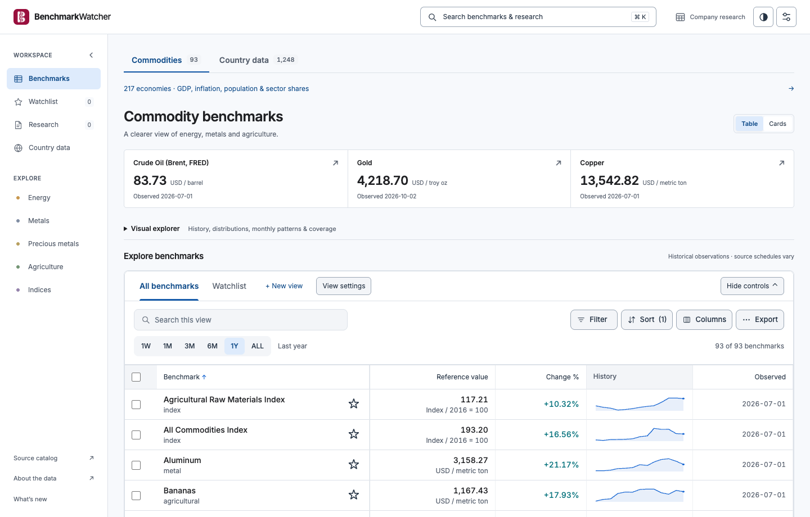
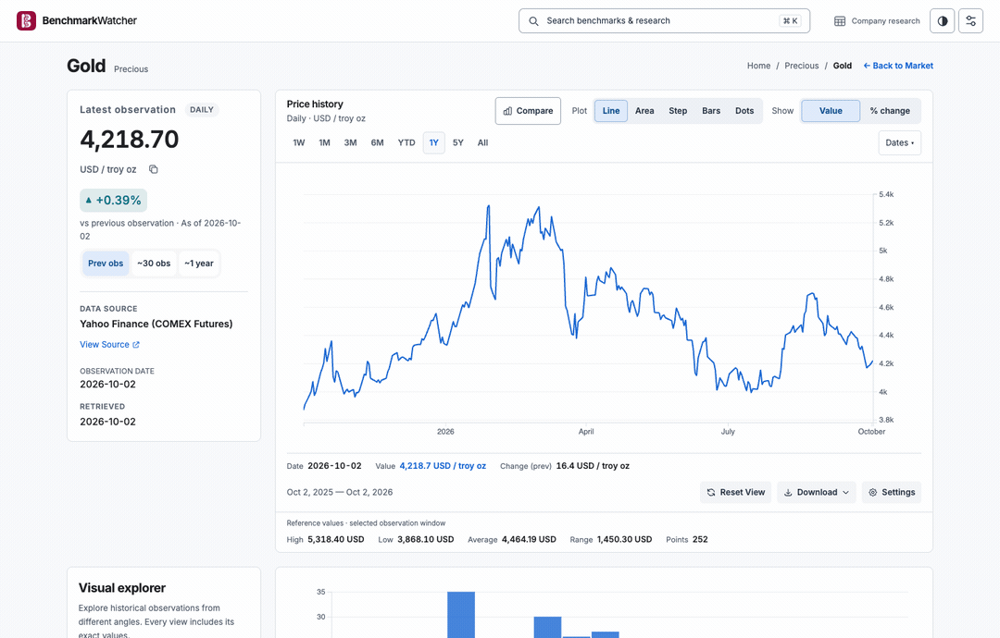
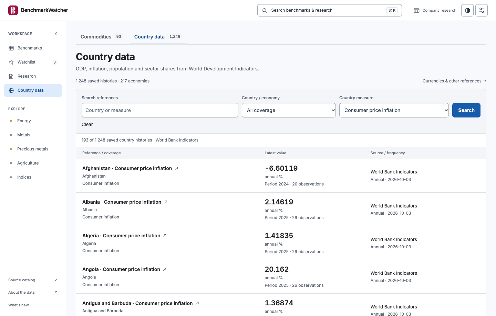

<div align="center">
  
  <h1>BenchmarkWatcher</h1>
  <p>Explore historical benchmarks, compare changes, and follow each number back to its source.</p>
  <p>
    <strong><a href="https://benchmarkwatcher.online">Open the app</a></strong> ·
    <a href="https://benchmarkwatcher.online/?dataset=countries">Explore country data</a> ·
    <a href="CONTRIBUTING.md">Contribute</a> ·
    <a href="https://benchmarkwatcher.online/changelog">What's new</a>
  </p>
</div>

[](https://benchmarkwatcher.online/?view=compact&range=1Y)

**A workspace for asking better questions of public data.** Browse energy, metals and agriculture; explore country indicators; or trace a company's reported figures to its filings. Dates, units and evidence stay close to the numbers.

**PRs welcome.** Help fix a rough edge, improve accessibility, document a workflow, or connect an official public data source. [Read the contributor guide](CONTRIBUTING.md) or [start a discussion in an issue](https://github.com/alikatgh/benchmarkwatcher/issues/new).

## See it in action

### Compare histories, inspect the evidence

Choose a date window, add up to four benchmarks, and inspect any observation. Each line has its own name, colour and dash pattern; tooltips show the series, date and value.

[](https://benchmarkwatcher.online/commodity/gold)

*Walkthrough: Gold → 1Y → Compare → Silver + Copper → inspect a point. [Try it yourself](https://benchmarkwatcher.online/commodity/gold).* A comparison starts each series at 0% on its first available date in the window. Baseline dates remain visible and can differ; missing observations are left open.

### Explore country data

Find an economy or measure, then open its history for exact observations and attribution. GDP, inflation, population and sector shares are available from the homepage.

[](https://benchmarkwatcher.online/?dataset=countries&indicator=FP.CPI.TOTL.ZG)

*Screenshots and walkthrough captured from the anonymous public app on 3 October 2026. Values are historical source observations, not live quotes.*

### More ways to investigate

- **Make the workspace yours:** search, filter, sort, choose columns, save views and keep a watchlist. Phones use compact rows with values visible.
- **Explore distributions and patterns:** switch between history, distributions, quartiles, monthly averages, heatmaps and observation coverage. Exact values remain available.
- **Export your work:** download reference data or a chart; choose line, area, step, bars or dots and preset or custom date windows.
- **Research companies:** resolve a name or ticker to public SEC disclosures, review historical statements and save questions with filing evidence. Built-in metric answers need no AI key; optional provider commentary requires explicit sharing consent. [Coverage and calculation rules](docs/COMPANY_RESEARCH.md).

Public views and watchlists use browser-local storage. Signed-in company research is stored privately and separately.

## Build with us

A focused bug fix, a clearer example or a better mobile interaction is a useful contribution. You can also help with source attribution, translations, and the native Swift and Kotlin apps.

1. [Browse issues](https://github.com/alikatgh/benchmarkwatcher/issues), or open one with the problem you want to solve.
2. Fork the repository and run the isolated preview below.
3. Make a focused change, run the relevant checks, and open a pull request with what changed and how you verified it.

Small fixes can go straight to a PR. For larger features or new sources, discuss the approach first. The [contributor guide](CONTRIBUTING.md) covers setup, source requirements and the project's scope.

## Run locally

Use **Python 3.11+** and **Node.js 20+**. From the repository root:

```sh
bash scripts/setup_local.sh
PLAYWRIGHT_PORT=5784 .venv/bin/python -m tests.e2e.server --companies
```

Open **http://127.0.0.1:5784**. This preview uses synthetic benchmark and company fixtures with temporary accounts. It needs no production credentials or paid provider. The complete public dataset is not bundled with the repository.

For normal development, configuration and public-data fetching, follow [local development](docs/LOCAL_DEVELOPMENT.md). See [security guidance](SECURITY.md) and [API hardening](docs/API_HARDENING.md) before changing authentication or public endpoints.

<details>
<summary><strong>Development checks</strong></summary>

Run the checks relevant to your change:

```sh
.venv/bin/python -m pytest tests
npm test
npm run check:vocab
npm run test:e2e
npm run test:visuals
npm run test:companies
```

Browser checks use isolated fixtures. `npm run build:css` rebuilds the Tailwind stylesheet when its inputs change. The [local development guide](docs/LOCAL_DEVELOPMENT.md) explains configuration and test commands.

</details>

## Data coverage

Public snapshot on **3 October 2026**:

| Dataset | Histories | Coverage |
| --- | ---: | --- |
| Commodities and commodity indices | 93 | Energy, metals, precious metals, agriculture and indices |
| World Bank country data | 1,248 | 217 economies, six measures, 31,088 observations across 2000–2025 |
| Other global references | 8 | Selected exchange references, European consumer inflation and Malaysian administered retail fuel prices |

**1,248 country histories means country/indicator combinations, not 1,248 APIs.** The [source catalog](https://benchmarkwatcher.online/sources) records 31 publishers with their access and integration status. Coverage varies by measure and year.

<details>
<summary><strong>Providers, units and comparison rules</strong></summary>

The six country measures are population, GDP in constant 2015 US dollars, GDP per capita, consumer inflation, agriculture/forestry/fishing share, and industry including construction share. Estimates and missing periods retain their source meaning.

Global-source readers cover the Bank of Canada, European Central Bank, Eurostat, World Bank and Malaysia Ministry of Finance. Catalogued sources without a reader are labelled accordingly. Commodity references also use FRED, EIA, USDA NASS and public Yahoo Finance references where available.

Every history identifies its provider, units and observation cadence. Public pages read cached data; browsing does not trigger upstream downloads. Readers use bounded request budgets. Free access does not remove publisher-specific reuse terms or rate limits. See [global source coverage](docs/GLOBAL_SOURCES.md) and the [data fetching guide](docs/DATA_FETCHING_GUIDE.md).

Percentage-change and indexed comparisons require a positive baseline. The workspace also offers Index 100; raw Value comparisons require matching currency and units. Baseline dates use each series' first available observation in the selected window. Missing observations are not filled or treated as zero; normalized lines do not imply equal prices or causation.

</details>

## Native apps and other clients

[`native/`](native/README.md) contains developing **Swift/SwiftUI apps for iPhone and macOS** and a **Kotlin/Jetpack Compose app for Android**, with platform-specific navigation and layouts. These are development targets, **not published App Store or Google Play releases**.

[`mobile/`](mobile/) contains the older Expo/React Native implementation, separate from the Swift and Kotlin targets. [`bots/`](bots/) contains Telegram and Discord readers.

## Data limits and license

BenchmarkWatcher provides historical reference data and descriptive, backward-looking calculations for informational and educational use. It provides no real-time market feed, trade execution, forecasts, trading signals or financial advice.

Data may be delayed, incomplete, unavailable or revised. Record-based windows may differ from calendar periods. All data is provided as is; do not make financial decisions based on this software. The authors and contributors disclaim liability for its use or interpretation.

Application code is [MIT licensed](LICENSE). Upstream datasets retain their own licenses and attribution requirements.

[Support](https://benchmarkwatcher.online/support) · [Privacy](https://benchmarkwatcher.online/privacy) · [Report an issue](https://github.com/alikatgh/benchmarkwatcher/issues) · [Contribute](CONTRIBUTING.md)
